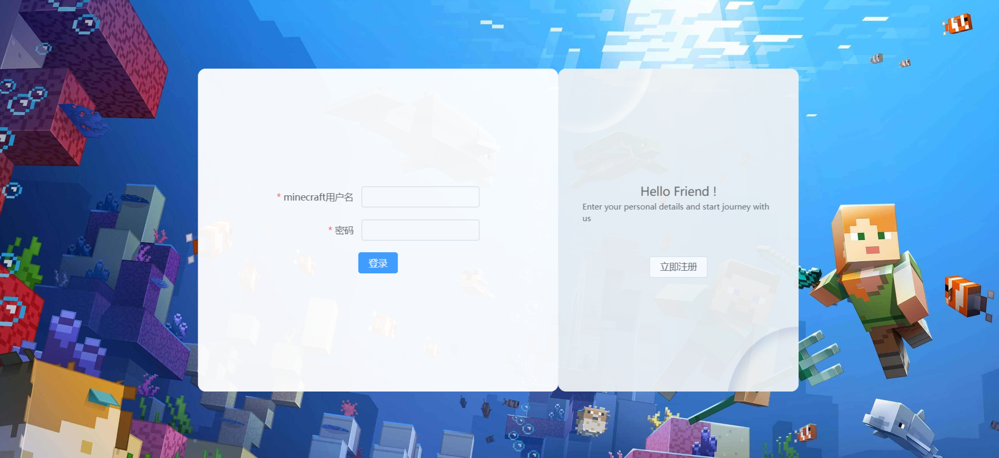

# EasyMinecraftServer (developing...)
This is an experimental project to let me learn the rust language.

This project is based on rust+Vue3. The functions include the login and register of server users, notice on the server, kick off and so on. My future aim is to back up worlds automatically and control the users in the server convinecely. These will be achieved in the first version.

